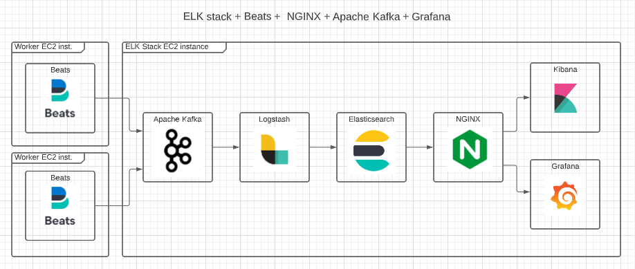
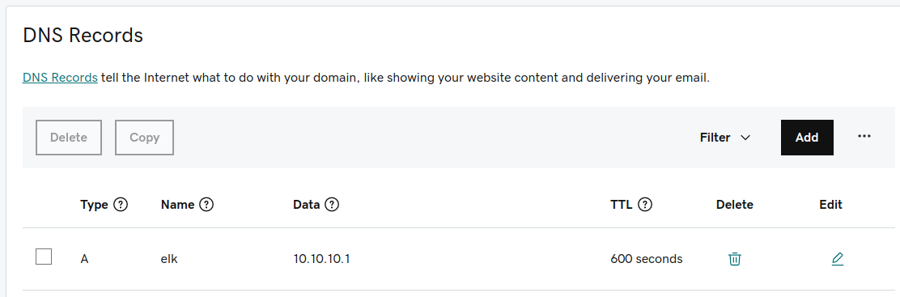
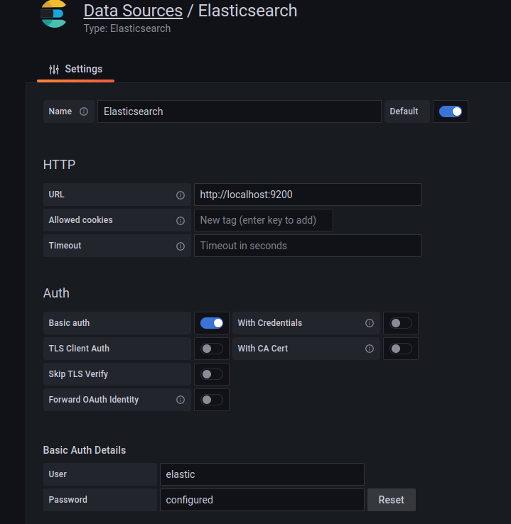
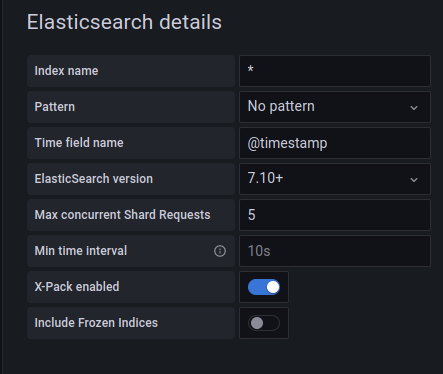
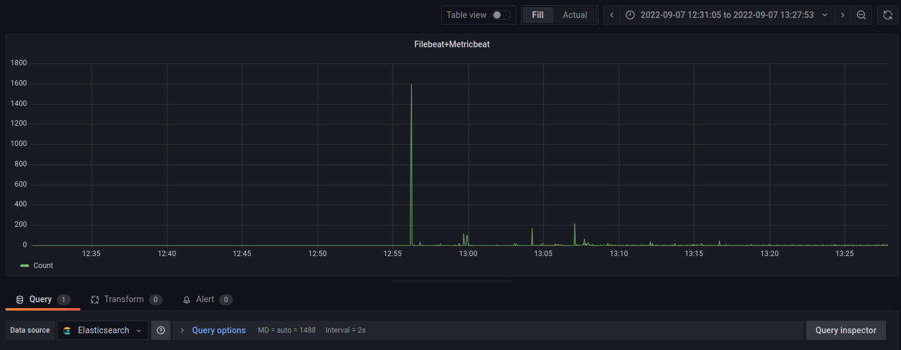

Create environment with terraform and configure ELK stack + Kafka + Nginx + Beats with Ansible playbook.

Here are 3 options of running project:<br />
a) All environment is AWS oriented, it is necessary to have domain in Route53 and asigned to this domain certificate in Certificate Manager service. In this case we use folder terraform_ALB_Route53_managed for creation infrastructure with terraform. Terraform create: Application Load Balancer, Load Balancer target group, Load Balancer listeners, A record related to DNS subdomain, network security groups, ELK stack and worker EC2 instances.<br />
<br />
b) We have domain from other domain provier (f.e. GoDaddy in my case) and secure HTTPS connection with Let's Encrypt SSL certificate. In this case we use folder terraform_terraform_EC2_managed for creation infrastructure with terraform. Terraform create network security groups, ELK stack and worker EC2 instances. We need to create (or change) manually A record in our domain provider configuration for assignation with public IP address.<br />
<br />
c) We don't have any domain and secure HTTPS connection with OpenSSL certificate. In this case we use folder terraform_terraform_EC2_managed for creation infrastructure with terraform. Terraform create network security groups, ELK stack and worker EC2 instances.<br />



1.  clone the repo
```git clone git@github.com:Andr1500/ELK_NGINX_Kafka_Grafana.git```

2.  go to terraform folder<br />
set aws credentials, credentials can be exported as environment variables:<br />
```export AWS_SECRET_ACCESS_KEY="SECRET_KEY"```<br />
```export AWS_ACCESS_KEY_ID="ACCES_KEY"```<br />
run ```terraform init```<br />
if everything is ok, run ```terraform plan``` and ```terraform apply```.<br /> Infrastructure in AWS will be created and inventory file hosts.txt in ELK_stack directory.

3. All Ansible variables are in ELK_stack/group_vars/all.yml . Add ```server_domain``` and ```certbot_mail_address``` variables if you need to assign Let's Encrypt SSL certificate to NGINX server and use domain name. Here is in use domain from GoDaddy and it's necessary to create (or change) A record for forwarding traffic to the created server. In case you don't have any domain name you can use self-assigned OpenSSL certificate.

4. Go to ELK_stack folder and run:<br />
a) for the enviromnent with Sertificate Manager SSL certificate:<br />
for installation and configuration ELK stack:<br />
```ansible-playbook -i hosts.txt -l elk_stack ELK_stack_cermanager.yml```<br />
for installation and configuration workers:<br />
```ansible-playbook -i hosts.txt -l worker ELK_beats.yml```<br />
b) for the environment with Let's Encrypt SSL certificate:<br />
for installation and configuration ELK stack:<br />
```ansible-playbook -i hosts.txt -l elk_stack ELK_stack_letsencrypt.yml```<br />
for installation and configuration workers:<br />
```ansible-playbook -i hosts.txt -l worker ELK_beats.yml```<br />
Next, go to your hosting provider and add A record.<br />
<br />
c) for the environment with OpenSSL SSL certificate:<br />
for installation and configuration ELK stack:<br />
```ansible-playbook -i hosts.txt -l elk_stack ELK_stack_openssl.yml```<br />
for installation and configuration workers:<br />
```ansible-playbook -i hosts.txt -l worker ELK_beats.yml```<br />

5. Copy public IP address, go to any WEB browser and paste in search bar. It will be automatically redirest to https and you can see information that the page is not secure if you installed Nginx with OpenSSL certificate. Ignore it and go to the web page. If you configured "ELK stack" with Let's Encrypt or Certificate Manager certificate it will be automatically redirect to domain name.

6. Choose "Kibana service" and login into with elastic credentials. Next choose "Kibana/Index Patterns" -> Create index pattern. Created patterns will be available in "Disconer" options.

7. Choose "Grafana service" and login into with Grafana admin_user and Grafana admin_pasword credentials. Next add the source of the data: Data Sources -> Elaticsearch.




8. Add new dashboard: Dashboards -> New Dashboard -> Add a new pannel -> Apply -> Save Dashboard -> Save.


